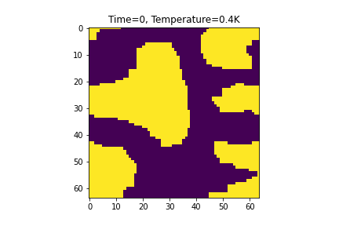
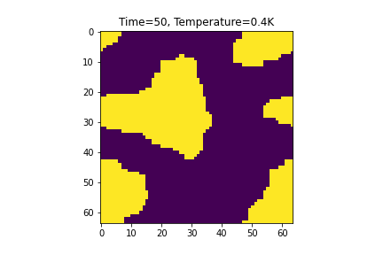
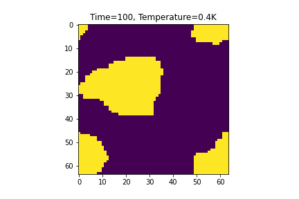
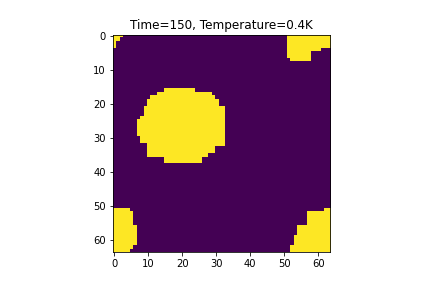

# 2D-Ising-Model

Monte Carlo simulation of the 2D Ising Model, using pure Python as well as CUDA.

Use the jupyter notebook to play around with the simulation by varying different quantities.

Plots of a system of size 64x64 at various stages.

Plots of a few quantities of interest, showing the phase transition around T = 2.26K.

